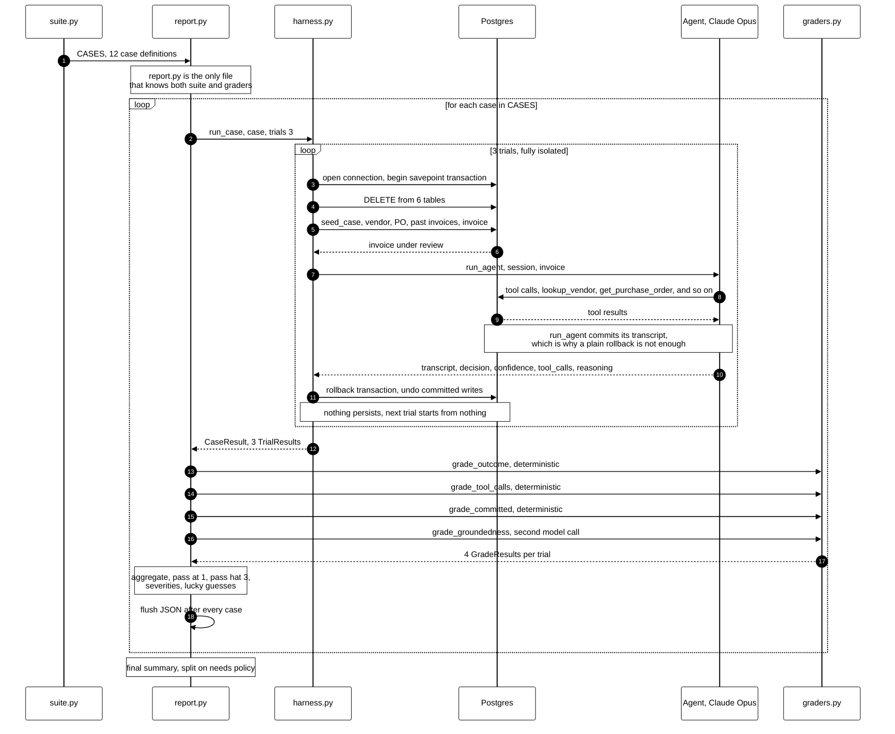

# Eval pipeline diagrams

Companion drawings to the architecture sketch, for the demo. Same shape
language: circles are model calls, rectangles are deterministic code,
cylinders are data stores. Plain black on white to match the hand-drawn
architecture diagram.

Both are Mermaid, so they render in GitHub, Obsidian, or
<https://mermaid.live> without any hosting.

**Editing note:** circle `(( ))`, cylinder `[( )]` and stadium `([ ])` labels
are parser-sensitive — keep them to plain words and commas. Parentheses,
slashes, ` ` and em dashes inside those shapes cause parse errors.
Rectangles tolerate all of it.

## 1. Structure — who calls whom

What the pipeline is made of and how data moves through it.

```mermaid
%%{init: {
  "theme": "base",
  "themeVariables": {
    "background": "#ffffff",
    "primaryColor": "#ffffff",
    "primaryBorderColor": "#000000",
    "primaryTextColor": "#000000",
    "lineColor": "#000000",
    "secondaryColor": "#ffffff",
    "tertiaryColor": "#ffffff",
    "edgeLabelBackground": "#ffffff",
    "fontFamily": "monospace"
  }
}}%%
flowchart LR
    CASES["suite.py<br/>12 case definitions"]
    LOOP["report.py, run_all<br/>x12 cases, 3 trials each"]

    subgraph HARNESS["harness.py, run_case, 3 isolated trials"]
        SEED["seed_case<br/>vendor, PO, history"]
        DB[(Postgres, same DB as the app, emptied inside the trial transaction)]
        AGENT((Agent, Claude Opus))
        SEED -->|seeds rows| DB
        SEED -->|invoice| AGENT
        DB -->|every tool call queries this| AGENT
    end

    TRIAL([TrialResult, decision, confidence, tool_calls, reasoning])

    G1["grade_outcome<br/>decision equals expected"]
    G2["grade_tool_calls<br/>required tools present"]
    G3["grade_committed<br/>submitted, or forced by limit"]
    G4((grade_groundedness, judge Claude Sonnet))

    AGG["report.py, aggregate<br/>pass at 1, pass hat 3, severities<br/>lucky guesses, needs policy split"]
    OUT[(eval_results json, plus terminal summary)]

    CASES -->|CASES| LOOP
    LOOP -->|case| SEED
    AGENT -->|submit_recommendation| TRIAL
    TRIAL -->|plus EvalCase| G1
    TRIAL -->|plus EvalCase| G2
    TRIAL -->|plus EvalCase| G3
    TRIAL -->|plus EvalCase| G4
    G1 -->|GradeResult| AGG
    G2 -->|GradeResult| AGG
    G3 -->|GradeResult| AGG
    G4 -->|GradeResult| AGG
    AGG -->|writes| OUT

    classDef rectNode fill:#ffffff,stroke:#000000,stroke-width:1.5px,color:#000000;
    classDef circleNode fill:#ffffff,stroke:#000000,stroke-width:2px,color:#000000;
    classDef cylNode fill:#ffffff,stroke:#000000,stroke-width:1.5px,color:#000000;
    classDef pillNode fill:#ffffff,stroke:#000000,stroke-width:1.5px,color:#000000;

    class CASES,LOOP,SEED,G1,G2,G3,AGG rectNode
    class AGENT,G4 circleNode
    class DB,OUT cylNode
    class TRIAL pillNode

    style HARNESS fill:none,stroke:#000000,stroke-width:1.5px,stroke-dasharray:6 4
```

## 2. Sequence — the order it actually happens in

Answers the "does report run it, or does harness?" question directly.

## Talking points

**Ownership split.** `suite.py` is pure data and is imported only by
`report.py`. `harness.py` is pure execution mechanics — it runs whatever
single `EvalCase` it is handed and has no idea the 12-case suite exists.
`report.py` is the only file that knows about both the suite and the
graders; it is a thin orchestrator, not the executor.

**Isolation is the load-bearing design choice.** Two of the agent's tools,
`get_invoice_history` and `check_duplicate_invoice`, answer questions about
accumulated state — so a trial that leaves rows behind does not merely
pollute the next one, it changes what the next one is testing. `run_agent`
commits mid-trial when it saves the transcript, so rolling back at the end
is not enough on its own; each trial runs inside an outer transaction with
the session in savepoint mode.

**There is no separate eval database.** `harness.py` builds its engine from
the same `settings.database_url` the app uses, and wipes the same six
tables — `agent_runs`, `audit_log`, `line_items`, `invoices`,
`purchase_orders`, `vendors` — before *every trial*, 36 times in a full
run. `documents`, the policy corpus, is excluded so RAG keeps working and
nothing has to be re-embedded.

Crucially, those `DELETE`s run *inside* the transaction that is rolled back
at the end of the trial, so real data is never destroyed: the eval sees an
empty world, every other connection still sees the real rows, and the
deletes are undone along with everything the agent wrote. Compare
`fixtures/seed_demo.py`, which runs the same `DELETE` loop over the same
six tables but commits for real — same table list, opposite consequences.
The harness borrows the database and gives it back; the demo reset actually
wipes it.

Two practical notes: do not run evals and the demo at the same time, since
the `DELETE` holds row locks on all six tables for the duration of each
trial. And if the eval process is killed mid-run, Postgres rolls the open
transaction back when the connection drops — there is nothing to clean up
by hand.

**Four graders, one of which is itself a model.** Three are deterministic.
`grade_groundedness` is a second, cheaper judge model, deliberately not the
model under test — it catches the failure the other three are blind to: a
right answer reached by recalling a plausible rule rather than retrieving
one.

**Running it.** `cd backend && python -m app.eval.report <label>`, which
writes `eval_results_<label>.json`. Manual one-shot script, no pytest
wrapper and no CI hook — which is what makes the before/after comparison a
single measurement rather than an iterative tuning loop.
